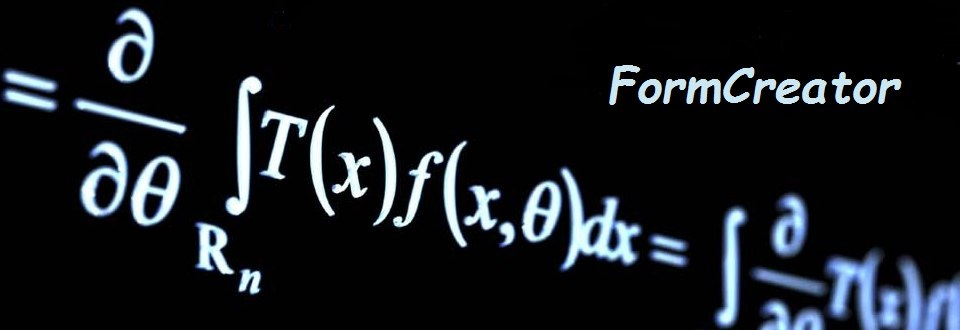
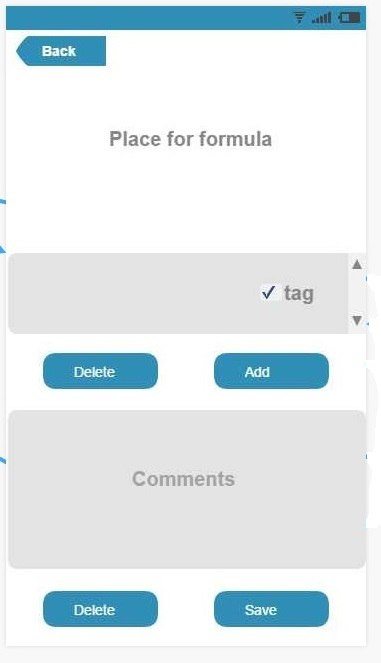
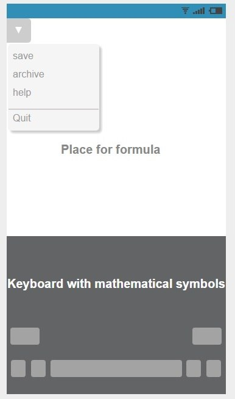
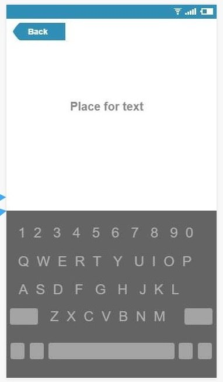

# FormCreator

## Введение. Цель проекта.
Целью проекта является создания редактора формул - мобильного приложения, облегчающего процесс набора формул, а также их пересылки другим пользователям. Под пересылкой формул подразумевается возможность набора формул из чисел, текста и графических примитивов, превращение этих данный в объект отдельного типа - формулы - и пересылки копии этого объекта внутри приложения другому пользователю. Также приложение позволяет сохранять формулу в специальном формате ".frml" или картинке, для моментальной последующей пересылки с использованием других приложений: Gmail, VK, Skype и прочие. Это нужно для того, чтобы другой пользователь смог воспользоваться данной готовой формулой, не используя никаких дополнительных средств, помимо данного приложения. Ниша рынка данного приложения - формульные библиотеки и редакторы: в приложении предусмотрено сохранение набранных или принятых от других пользователлей формул в специальном формате. Формулы объединенные пользователем общими тегами будем называть "формульной библиотекой с тэгом *название тэга*".
*Рыночная ниша проекта*
Целевой аудиторией проекта являются люди, часто имеющие дело с формулами. К ним можно в первую очередь отнести студентов, преподователей и др. людей, работающих в технической сфере. Данное приложение призвано облечить их трудовые будни.

## Сравнение с аналогами
|Критерий | FormCreator| Equation Editor (tinkutara) | MathMagic Lite | Equation Editor (Marek)|
|---------|------------|-----------------------------|----------------|------------------------|
|Использование русского языка | да | нет | нет | нет |
|WYSIWYG (What-You-See-Is-What-You-Get) редактор | да | да | да | нет |
|Пересылка формул | да | нет | да | да |
|"Формульная библиотека" | да | да | нет | нет |

## Требования к аппаратуре
1. Android 2.3+
2. Минимальное разрешение: 480×800
3. Минимальная диагональ экрана 4 дюйма, инимальное разрешение 480×800. 
4. Максимальная диагональ экрана 5.5 дюйма, максимальное разрешение 1920×1080.

## Требования к программному обеспечению
 

## Средства разработки программного обеспечения
Android SDK (25, Nougat), Android Studio (2.3).

## Характеристики продукта
*Расход памяти* 
Расход памяти примерно 50 мб.

*Производительность*

*Надежность*

## Формат входных данных
1. Формулы
2. Изображения

## Формат выходных данных
1. Текст
2. Числа
3. Формулы(специальный формат)
4. Изображения

## Установка продукта

## Запуск продукта

## Описание интерфейса пользователя
Приложение должно обеспечивать возможность быстрого ввода формул, их сохранения и просмотра уже сохраненных. Для реализации этих возможностей будут созданы четыре окна: окно ввода формул, окно сохранения, архив формул и стр. с подробынм описанием формулы.
### Окно сохранения формул 
В верхней области данного окна распологается формула, которую хочет сохранить пользователь. Под формулой находится поле для ввода тегов, под которым распологаются кнопки "add" и "delete". После нажатия на кнопку "add" открывается окно для ввода текста (тэга), а после нажатия на кнопку "delete" происходит удаление выделенных тэгов. Под кнопками "add" и "delete" распологается поле для ввода комментариев и две кнопки "save" и "delete". При нажатии на поле комментариев также происходит открытие окна для ввода текста. При нажатии на кнопку "delete" удаляется, соответствующая формула. А при нажатии на кнопку "save" происходит сохранение формулы или, если формула уже существовала, сохранение внесенных изменеий. 
 
### Окно архива формул 
Вверху окна распологается поле ввода, позволяющее найти формулу по тегу. Далее следует список формул. При нажатии на какую-нибудь из формул появляется выпадающее меню, содержащее поля: "info", "send", "delete". При нажатии на эти кнопки происходит соответственно: переход на стр. сохранения формул (она также является стр. просмотра и редактирования), отправка формулы, удаление. 
 
### Окно ввода формул 
Вверху окна распологается кнопка "menu", при нажатии на которую появляется список, содержащий такие элементы, как "save", "archive", "help", "Quit". Нажатие на эти элементы соответственно приведет к переходу на стр. сохранения формул, в архив, на стр. со справочной информацией или к выходу. Далее распологается поле для ввода формулы. Под ним специальная клавиатура, содержащая алфавит, цифры и некоторые часто используемые символы. 
 
### Страница для ввода текста 
Данная стр. открывается, когда нужно ввести тэг или комментарий под формулой.

## Описание API библиотеки
Приложение представляет собой законченное standalone приложение и не предполагает наличия внешнего интерфейса (это не библиотека). 

## Детали реализации

## Тестирование. Классы тестов
Тестирование будет разбито на несколько этапов:
### Этап тестирования ввода формул.
На этом этапе тестируется специальная клавиатура, при помощи которой вводятся формулы. Проводится список тестов с наборами различных простейших формул.
### Этап тестирования сохранения и загрузка формул.
На этом этапе тестируется возможность сохранения формул в специальном формате. В каждом тесте проводится сохранение формулы и последующая её загрузка, после которой проверяется на соответствие исходной формуле.
### Этап тестирования редактирования формул.
На этом этапе тестируется возможность редактирования формул. Под редактированием подразумевается возможность вносить изменения в описание формулы, добавление тэгов, то есть изменение уже сохранённых формул.
### Этап тестирования сохранения формул в виде изображений.
На этом этапе тестирования тестируется возможность сохранения формул в виде изображений и мгновенная пересылка их через интернет.

## Ссылки и литература
[Генерация картинок для Android приложения из SVG](https://m.habrahabr.ru/post/229395/)